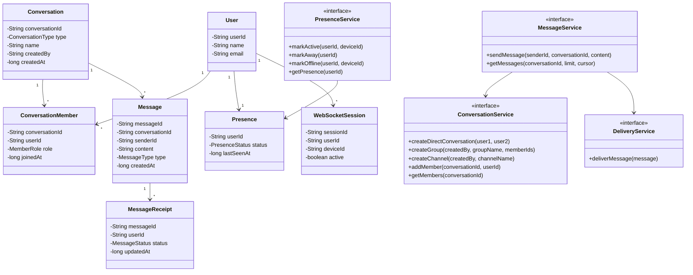

Here’s a clean **40-minute interview-ready LLD answer** for:

**Design a real-time messaging platform like Slack supporting 1:1 messaging, group messaging, broadcast channels, and user presence.**

---

## 1. Scope the requirements first

In interview, don’t jump into classes directly. Start by narrowing the problem.

### Functional requirements

I would confirm these with interviewer:

1. Users can send **one-to-one messages**.
2. Users can create **group conversations**.
3. Users can create or join **broadcast channels**.
4. Users should receive messages in **real time** if they are online.
5. If users are offline, messages should be stored and delivered later.
6. Users should see presence status like **ACTIVE, AWAY, OFFLINE**.
7. Users can fetch message history.
8. System should support read receipts or delivery receipts if time allows.

### Non-functional requirements

For a 40-minute LLD round, keep these simple:

1. Low latency message delivery.
2. Message durability.
3. Scalable to many users and groups.
4. Duplicate message handling.
5. Presence should be eventually consistent, not perfectly accurate every millisecond.

### Out of scope

Say this clearly to save time:

1. Voice/video calls.
2. File uploads.
3. Message search.
4. Encryption details.
5. Admin moderation.
6. Slack app integrations.
7. Threaded replies, unless interviewer asks.

---

## 2. Clarification questions to ask

These are good interview follow-ups before designing:

1. Do we need to support only text messages, or attachments also?
2. Should channels be public/private, or can we keep them simple?
3. Do we need message ordering per conversation?
4. Is read receipt required?
5. Should presence be updated based on WebSocket connection, heartbeat, or manual user status?
6. Should broadcast channels allow only admins to send messages?
7. Do we need multi-device support for the same user?
8. Should offline users receive push notifications?
9. Do we need message deletion/editing?
10. What scale should we assume: thousands, millions, or enterprise workspace scale?

For a 40-minute answer, I would say:

> I’ll assume text-only messaging, message ordering within a conversation, WebSocket-based real-time delivery, offline message storage, simple presence using heartbeat, and channels where only authorized members can send or receive messages.

---

## 3. Core building blocks

At high level, I would break the system into these components:

### Client

Web/mobile/desktop client. Maintains WebSocket connection with server.

### API Gateway

Handles HTTP requests like login, create conversation, fetch messages, join channel.

### WebSocket Gateway

Maintains real-time connections with online users.

### Message Service

Validates messages, stores them, publishes events for delivery.

### Conversation Service

Manages 1:1 chats, group chats, and channels.

### Presence Service

Tracks user online/away/offline status using heartbeats.

### Notification Service

Sends push/email notification when user is offline.

### Message Store

Stores messages durably.

Example: PostgreSQL, Cassandra, DynamoDB, MongoDB depending on scale.

### Cache / Presence Store

Redis is a strong fit for active user sessions and presence.

### Message Queue / PubSub

Kafka, Redis PubSub, SNS/SQS, or RabbitMQ for async delivery.

For interview, Kafka is a good answer because it helps with reliable event flow.

---

## 4. High-level architecture

```text
                 +----------------+
                 |    Client      |
                 | Web/Mobile App |
                 +--------+-------+
                          |
              HTTP APIs   |   WebSocket
                          |
        +-----------------+-----------------+
        |                                   |
+-------v-------+                   +-------v---------+
|  API Gateway  |                   | WebSocket Server |
+-------+-------+                   +--------+--------+
        |                                    |
        |                                    |
+-------v---------+              +-----------v----------+
| Conversation    |              | Realtime Delivery    |
| Service         |              | Service              |
+-------+---------+              +-----------+----------+
        |                                    |
        |                                    |
+-------v---------+              +-----------v----------+
| Message Service |------------->| Kafka / PubSub       |
+-------+---------+              +-----------+----------+
        |                                    |
        |                                    |
+-------v---------+              +-----------v----------+
| Message Store   |              | Notification Service |
+-----------------+              +----------------------+

        +------------------+
        | Presence Service |
        +--------+---------+
                 |
        +--------v---------+
        | Redis Presence   |
        +------------------+
```

What this really means is:

When a user sends a message, the message first goes through the Message Service. The service stores it in the database, then publishes an event. The WebSocket server consumes that event and pushes it to all online recipients. If someone is offline, Notification Service can send push/email notification or simply leave the message in history for later fetch.

---

## 5. Main entities/classes

### Enums

```java
enum ConversationType {
    DIRECT,
    GROUP,
    CHANNEL
}

enum MessageType {
    TEXT,
    IMAGE,
    FILE
}

enum MessageStatus {
    SENT,
    DELIVERED,
    READ
}

enum PresenceStatus {
    ACTIVE,
    AWAY,
    OFFLINE
}

enum MemberRole {
    OWNER,
    ADMIN,
    MEMBER
}
```

---

## 6. Entities

### User

```java
class User {
    private String userId;
    private String name;
    private String email;
}
```

### Conversation

Used for 1:1, group, and channel.

```java
class Conversation {
    private String conversationId;
    private ConversationType type;
    private String name;
    private String createdBy;
    private long createdAt;
}
```

### ConversationMember

```java
class ConversationMember {
    private String conversationId;
    private String userId;
    private MemberRole role;
    private long joinedAt;
}
```

### Message

```java
class Message {
    private String messageId;
    private String conversationId;
    private String senderId;
    private String content;
    private MessageType type;
    private long createdAt;
}
```

### MessageReceipt

```java
class MessageReceipt {
    private String messageId;
    private String userId;
    private MessageStatus status;
    private long updatedAt;
}
```

### Presence

```java
class Presence {
    private String userId;
    private PresenceStatus status;
    private long lastSeenAt;
}
```

### WebSocketSession

```java
class WebSocketSession {
    private String sessionId;
    private String userId;
    private String deviceId;
    private boolean active;
}
```

---

## 7. Interfaces / Services

### MessageService

```java
interface MessageService {
    Message sendMessage(String senderId, String conversationId, String content);
    List<Message> getMessages(String conversationId, int limit, String cursor);
}
```

### ConversationService

```java
interface ConversationService {
    Conversation createDirectConversation(String user1, String user2);
    Conversation createGroup(String createdBy, String groupName, List<String> memberIds);
    Conversation createChannel(String createdBy, String channelName);
    void addMember(String conversationId, String userId);
    List<String> getMembers(String conversationId);
}
```

### PresenceService

```java
interface PresenceService {
    void markActive(String userId, String deviceId);
    void markAway(String userId);
    void markOffline(String userId, String deviceId);
    Presence getPresence(String userId);
}
```

### DeliveryService

```java
interface DeliveryService {
    void deliverMessage(Message message);
}
```

### NotificationService

```java
interface NotificationService {
    void notifyOfflineUsers(Message message, List<String> recipientIds);
}
```

### MessageRepository

```java
interface MessageRepository {
    void save(Message message);
    List<Message> findByConversationId(String conversationId, int limit, String cursor);
}
```

### ConversationRepository

```java
interface ConversationRepository {
    void save(Conversation conversation);
    Conversation findById(String conversationId);
}
```

---

## 8. UML diagram



---

## 9. APIs

### Create direct conversation

```http
POST /conversations/direct
```

Request:

```json
{
  "userId": "u2"
}
```

Response:

```json
{
  "conversationId": "c123",
  "type": "DIRECT"
}
```

---

### Create group

```http
POST /conversations/groups
```

Request:

```json
{
  "name": "Engineering Team",
  "memberIds": ["u1", "u2", "u3"]
}
```

---

### Create broadcast channel

```http
POST /channels
```

Request:

```json
{
  "name": "Company Announcements"
}
```

---

### Join channel

```http
POST /channels/{channelId}/members
```

Request:

```json
{
  "userId": "u4"
}
```

---

### Send message

```http
POST /messages
```

Request:

```json
{
  "conversationId": "c123",
  "content": "Hey, are you available?"
}
```

Response:

```json
{
  "messageId": "m789",
  "status": "SENT"
}
```

---

### Get message history

```http
GET /conversations/{conversationId}/messages?limit=50&cursor=abc
```

---

### WebSocket connect

```text
WS /realtime/connect?token=jwt
```

Client events:

```json
{
  "type": "MESSAGE_SEND",
  "conversationId": "c123",
  "content": "Hello"
}
```

Server events:

```json
{
  "type": "MESSAGE_RECEIVED",
  "messageId": "m789",
  "conversationId": "c123",
  "senderId": "u1",
  "content": "Hello",
  "createdAt": 1710000000
}
```

Presence heartbeat:

```json
{
  "type": "HEARTBEAT",
  "userId": "u1",
  "deviceId": "d1"
}
```

Presence update event:

```json
{
  "type": "PRESENCE_UPDATE",
  "userId": "u1",
  "status": "ACTIVE"
}
```

---

## 10. Message flow

### Case 1: One-to-one message

```text
User A sends message to User B
        |
Message Service validates membership
        |
Message saved to Message Store
        |
Message event published to Kafka/PubSub
        |
Delivery Service checks if User B is online
        |
If online: push through WebSocket
If offline: keep stored + send notification
```

Key point:

> I would store the message before pushing it. That way, even if WebSocket delivery fails, the message is not lost.

---

### Case 2: Group message

```text
Sender sends message to group conversation
        |
System fetches group members
        |
Message is stored once
        |
Delivery fanout sends event to online members
        |
Offline members get notification or fetch later
```

Important design choice:

For small/medium groups, we can fan out directly.

For very large channels, we should not create one copy per user immediately. We store one message and let users pull message history based on offset/cursor.

---

### Case 3: Broadcast channel

For broadcast channel, usually only admins or owners can post.

```text
Admin sends announcement
        |
Permission check
        |
Store message
        |
Publish event
        |
Deliver to active subscribers
```

For very large channels, use fanout-on-read:

```text
Store once -> users fetch when opening channel
```

Instead of pushing millions of individual copies.

---

## 11. Presence design

Presence should be simple and practical.

### How active status works

When client connects through WebSocket:

```text
User connects -> mark ACTIVE in Redis
```

Client sends heartbeat every 20 or 30 seconds:

```text
Heartbeat received -> update lastSeenAt
```

If no heartbeat for 60 to 90 seconds:

```text
No heartbeat -> mark AWAY or OFFLINE
```

Example:

```text
0-60 seconds since heartbeat     ACTIVE
60-5 minutes                     AWAY
More than 5 minutes              OFFLINE
```

### Redis structure

```text
presence:{userId} -> ACTIVE
last_seen:{userId} -> timestamp
sessions:{userId} -> set of active device sessions
```

Multi-device logic:

If user has 2 devices and one disconnects, don’t immediately mark offline.

```text
Only mark OFFLINE when all sessions are disconnected or expired.
```

---

## 12. Database tables

### users

```sql
user_id
name
email
created_at
```

### conversations

```sql
conversation_id
type
name
created_by
created_at
```

### conversation_members

```sql
conversation_id
user_id
role
joined_at
```

### messages

```sql
message_id
conversation_id
sender_id
content
message_type
created_at
```

### message_receipts

```sql
message_id
user_id
status
updated_at
```

### user_presence

This can be Redis-first, database optional.

```sql
user_id
status
last_seen_at
```

---

## 13. Class-level solution flow

### MessageServiceImpl

```java
class MessageServiceImpl implements MessageService {

    private MessageRepository messageRepository;
    private ConversationService conversationService;
    private EventPublisher eventPublisher;

    @Override
    public Message sendMessage(String senderId, String conversationId, String content) {

        if (!conversationService.isMember(conversationId, senderId)) {
            throw new RuntimeException("User is not part of this conversation");
        }

        Message message = new Message(
            UUID.randomUUID().toString(),
            conversationId,
            senderId,
            content,
            MessageType.TEXT,
            System.currentTimeMillis()
        );

        messageRepository.save(message);

        eventPublisher.publish("message.created", message);

        return message;
    }
}
```

### DeliveryServiceImpl

```java
class DeliveryServiceImpl implements DeliveryService {

    private ConversationService conversationService;
    private WebSocketConnectionManager connectionManager;
    private NotificationService notificationService;

    @Override
    public void deliverMessage(Message message) {

        List<String> members = conversationService.getMembers(message.getConversationId());

        for (String userId : members) {

            if (userId.equals(message.getSenderId())) {
                continue;
            }

            if (connectionManager.isOnline(userId)) {
                connectionManager.send(userId, message);
            } else {
                notificationService.notifyOfflineUsers(message, List.of(userId));
            }
        }
    }
}
```

### PresenceServiceImpl

```java
class PresenceServiceImpl implements PresenceService {

    private PresenceRepository presenceRepository;

    @Override
    public void markActive(String userId, String deviceId) {
        presenceRepository.addSession(userId, deviceId);
        presenceRepository.updateStatus(userId, PresenceStatus.ACTIVE);
    }

    @Override
    public void markOffline(String userId, String deviceId) {
        presenceRepository.removeSession(userId, deviceId);

        if (presenceRepository.getActiveSessionCount(userId) == 0) {
            presenceRepository.updateStatus(userId, PresenceStatus.OFFLINE);
        }
    }

    @Override
    public void markAway(String userId) {
        presenceRepository.updateStatus(userId, PresenceStatus.AWAY);
    }

    @Override
    public Presence getPresence(String userId) {
        return presenceRepository.getPresence(userId);
    }
}
```

---

## 14. Design patterns used

### 1. Strategy Pattern

Useful for different message delivery strategies.

```java
interface DeliveryStrategy {
    void deliver(Message message);
}
```

Implementations:

```java
class DirectMessageDeliveryStrategy implements DeliveryStrategy {}
class GroupMessageDeliveryStrategy implements DeliveryStrategy {}
class BroadcastChannelDeliveryStrategy implements DeliveryStrategy {}
```

Why?

Because one-to-one, group, and broadcast delivery are not exactly the same. Direct message has one recipient. Group has multiple recipients. Broadcast channel may use fanout-on-read.

---

### 2. Observer / PubSub Pattern

Message Service publishes an event:

```text
message.created
```

Other services react:

```text
Delivery Service
Notification Service
Analytics Service
Audit Service
```

This keeps Message Service clean.

---

### 3. Repository Pattern

Used to separate business logic from database code.

```java
MessageRepository
ConversationRepository
PresenceRepository
```

This makes testing easier.

---

### 4. Factory Pattern

Can be used to create the right conversation type.

```java
class ConversationFactory {
    Conversation createConversation(ConversationType type) {
        // create DIRECT, GROUP, or CHANNEL conversation
    }
}
```

---

### 5. Singleton Pattern

Connection Manager can be treated as a singleton per server instance.

```java
WebSocketConnectionManager
```

It maintains active WebSocket sessions for users connected to that server.

---

## 15. Important interview tradeoffs

### WebSocket vs polling

I would choose WebSocket because messaging needs real-time updates. Polling is simpler but creates unnecessary load and delay.

### Store first vs deliver first

Store first.

Reason:

If delivery fails after storing, the user can still fetch the message later. If we deliver first and storage fails, message history becomes inconsistent.

### Fanout-on-write vs fanout-on-read

For small groups:

```text
Fanout-on-write is fine.
```

For large channels:

```text
Fanout-on-read is better.
```

Because sending one message to millions of users immediately is expensive.

### SQL vs NoSQL

For LLD, I would say:

PostgreSQL works for clean relational modeling.

At large scale, messages can move to Cassandra/DynamoDB because message reads are usually by conversation ID and time range.

---

## 16. Edge cases

Mention these to sound practical:

1. User sends message but disconnects immediately.
2. Receiver has multiple devices open.
3. Duplicate message sent due to client retry.
4. User is removed from group but tries to send message.
5. Broadcast channel has huge number of members.
6. Message delivery succeeds but receipt update fails.
7. WebSocket server crashes.
8. Presence heartbeat delayed due to network issue.
9. Out-of-order message delivery.
10. User reconnects and needs missed messages.

For duplicate handling, client can send a `clientMessageId`.

```json
{
  "clientMessageId": "abc-123",
  "conversationId": "c1",
  "content": "hello"
}
```

Server stores with unique constraint:

```text
senderId + clientMessageId
```

---

## 17. How I would explain this in interview

Use this as your spoken answer:

> I’ll keep the design focused on text messaging, real-time delivery, message history, groups, channels, and presence. I’ll use WebSocket for live communication, HTTP APIs for regular operations like creating conversations and fetching history, Redis for presence, a database for message storage, and Kafka or PubSub for decoupling message creation from delivery.
>
> The main entities are User, Conversation, ConversationMember, Message, MessageReceipt, Presence, and WebSocketSession. Conversation will have a type: DIRECT, GROUP, or CHANNEL. That keeps the model simple instead of creating separate tables for every chat type.
>
> When a user sends a message, the Message Service first checks whether the sender belongs to that conversation. Then it stores the message. After storing, it publishes a message-created event. Delivery Service consumes that event and sends the message to online users through WebSocket. If the user is offline, we keep the message in history and optionally trigger Notification Service.
>
> Presence is handled separately. When the WebSocket connection opens, I mark the user active in Redis. The client keeps sending heartbeat events every 20 or 30 seconds. If heartbeat stops for some time, I mark the user away or offline. For multi-device, I only mark the user offline when all active sessions are gone.
>
> For normal groups, fanout-on-write is okay. For very large broadcast channels, I would store the message once and use fanout-on-read so we don’t push millions of copies immediately.
>
> Design-pattern wise, I’d use Repository Pattern for persistence, Strategy Pattern for different delivery behavior, PubSub/Observer Pattern for message events, and Factory Pattern to create direct, group, or channel conversations.

---

## 18. 40-minute answer structure

Use this order in interview:

```text
0-5 min     Clarify scope and assumptions
5-10 min    Identify core entities
10-18 min   Explain APIs and message flow
18-25 min   Explain class design and services
25-30 min   Presence handling
30-35 min   UML/design patterns
35-40 min   Edge cases and tradeoffs
```

That is enough. Don’t overbuild it. The goal is not to design entire Slack. The goal is to show clean modeling, real-time delivery, and practical tradeoffs.
